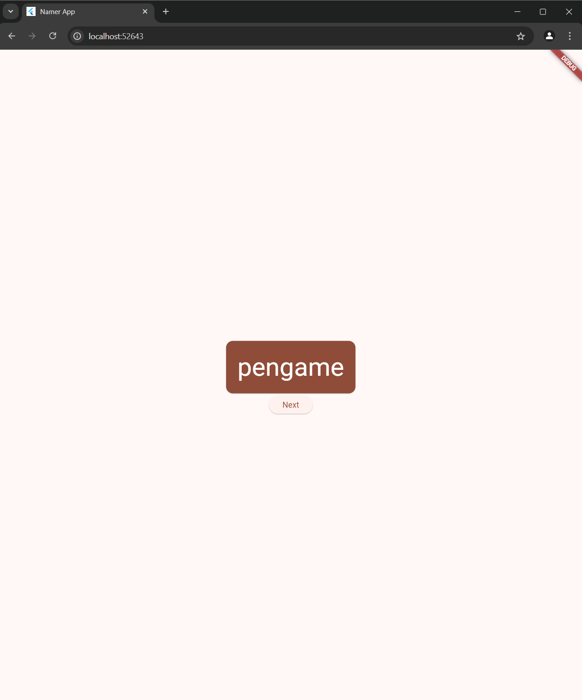

<table>
    <thead>
        <th style="text-align: center;" colspan="2">Pertemuan 2</th>
    </thead>
    <tbody>
        <tr>
            <td>Nama</td>
            <td>Raihan Fazzaufa Rasendriya</td>
        </tr>
        <tr>
            <td>NIM</td>
            <td>2241720201</td>
        </tr>
        <tr>
            <td>Kelas</td>
            <td>TI-3G</td>
        </tr>
        <tr>
            <td>Absen</td>
            <td>22</td>
        </tr>
    </tbody>
</table>

## Pemrograman  Mobile - Pertemuan 5 Tugas 4

# Langkah 1
Menambahkan Packages / dependencies pada file pubspec.yaml

# Langkah 2 
Menambahkan rules pada file analysis_options.yaml

# Langkah 3
Modifikasi kode file main + run

# Langkah 4
Menambah sesuatu pada string di `Text` pertama

# Langkah 5
Menambah button di bawah `Text` kedua

# Langkah 6
Menambah `getNext` di dalam `MyAppState`

# Langkah 7
Memanggil `getNext` dari button callback.

Hasil:

# Langkah 8
Mengubah widget `MyHomePage` pada `Text` kedua.

# Langkah 9
Membuat kelas baru `BigCard` melalui refaktor dari `Text` kedua.

# Langkah 10
Modifikasi widget card tersebut.

Hasil:

# Langkah 11
Menambah colortheme dan texttheme pada card serta mengatur posisi dari Card

Hasil:

